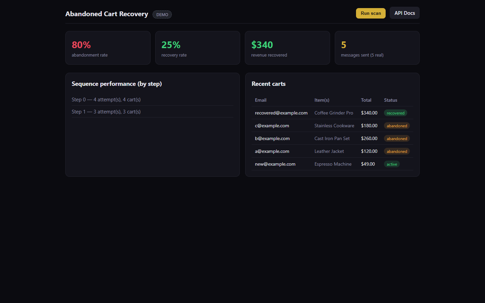
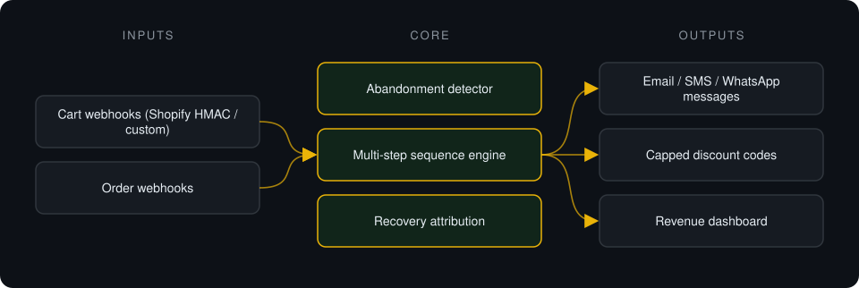
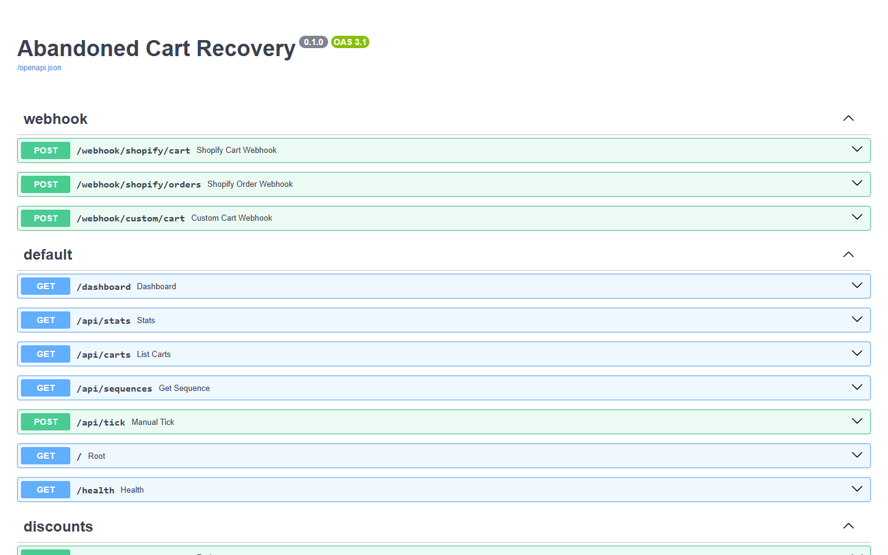

# Abandoned Cart Recovery

**Detects abandoned carts on Shopify or WooCommerce, runs a sequenced email/SMS/WhatsApp campaign, and attributes recovered revenue.**

> **This is a proprietary project. Source code is private. This page showcases the system's architecture and results.**

**Case study page:** [https://jryahia.github.io/showcase-abandoned-cart-recovery/](https://jryahia.github.io/showcase-abandoned-cart-recovery/)

## Problem it solves

Most stores do nothing about abandoned carts, or send one generic email days later. This system reacts within the hour with a personalized sequence and counts recovered revenue only when a later order really follows a campaign attempt.

## Architecture

1. Cart events arrive by webhook; quiet carts are marked abandoned after a window.
2. A multi-step sequence sends personalized messages referencing the actual cart.
3. Optional discount codes are time-limited and capped.
4. When a later order completes, it is matched to the campaign and recovered revenue is attributed.

## Key features

- Shopify HMAC-verified webhooks
- Sequenced multi-channel recovery
- Cart-aware personalization
- Traceable revenue attribution
- Unconfigured channels clearly labelled as demo, never reported as sent

## Tech stack

     

## What it does in practice

- Reports recovered revenue backed by a traceable link between campaign and order.

## Screenshots

**Abandonment, recovery and per-step performance**

**API surface: Shopify and custom webhooks, stats, discounts**

---

Built by [Yahya Jarray](https://github.com/jryahia). Interested in a similar system? [Get in touch](mailto:yahiajarray43@gmail.com).

This repository contains no source code. It is a case study for a proprietary project. © Yahya Jarray.
